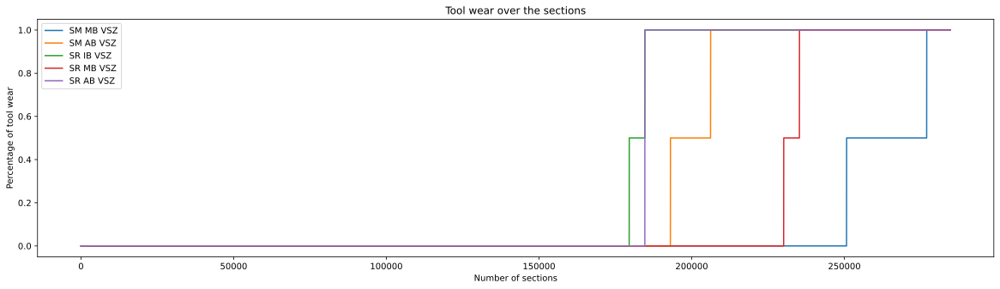
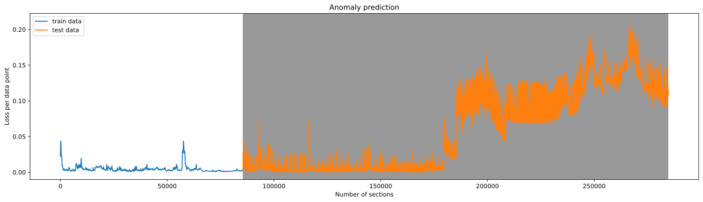

 ---
title: "AI driven tunnel drilling"
date: 2018-06-08T15:06:32+02:00
draft: true
author: "Stephan Munsch"
tags: [Artificial Intelligence, Predictive Maintenance, Data Exploration, Data Science]
summary: "Unearthing Efficiency: Revolutionizing Tunnel Drilling Through Predictive Maintenance"
---

In the underground world, where progress is measured by tons of rock and miles of tunnels, the tunnel drilling industry is on the point of a significant change. At the center of this shift is an initiative that combines artificial intelligence with the traditional craft of tunnel boring.
This blog article will guide you through the application of Long-Short-Term Memory (LSTM) models in the tunnel boring process to advance predictive maintenance in tunnel construction.

## Maidl TC
With more than 40 years and the experience in  over 200 global projects [Maidl Tunnelconsultants](https://www.maidl-tc.de/en/index.html) is one of the leading experts in tunneling. With their Software [PROCON II](https://procon.maidl-tc.de/guide/en/PROCON_Guide.html#procon_modules ) Maidl TC is able to support  both  tunnel constructors and contractors with real-time data management of the tunnel boring machine. It provides smart data analysis, data visualization, and many more options. Through the data collected by PROCON II each of the participants is able to gain a deeper insight into the current state of the tunnel borer.

## The vision
With the utilization of the collected data Maidl TC wants to revolutionize the way we build tunnels. This is possible through smarter tunnel construction by seamlessly incorporating advanced LSTM technology. We want to lead the way into a future where predictive maintenance is all about efficiency, reliability and sustainability. By using data-driven insights we make sure our machines work at their best  by reducing downtime and helping create underground structures that are not only safer but also more cost effective.

## Business Understanding
Each tunnel boring machine is uniquely designed and manufactured for each specific tunnel project. The production of a tunnel borer is not only costly, but the operational expenses also significantly contribute to the overall project costs. One key cost indicator is the specific energy, which measures the total energy consumption during drilling. Specific energy serves as a valuable metric for estimating project expenses. In addition to specific energy, tool wear and the volume of drilling foam used are factors influencing the costs of drilling projects. The quantity of drilling foam directly affects the wear and tear of cutting tools.

The ultimate objective is to minimize project costs while maintaining efficient drilling operations. However, the condition of the tools can only be assessed during scheduled maintenance breaks. Delayed detection of tool wear can lead to increased wear on other cutting tools, necessitating more frequent replacements and, subsequently, higher expenses.

The goal is to identify potential tool failures in advance, enabling more efficient drilling operations. This can be achieved through anomaly detection using real-time data from Maidl-TC's PROCON software.

## Data Understanding
To kickstart our prototype development, we received data snippets from a prior Maidl-TC project. Collaborating closely with Maidl's experts, we delved into the data, gradually gaining insights into crucial values and interdependencies. We harnessed [pandas](https://pandas.pydata.org/docs/index.html) for data analysis, and our partnership with the client's experts allowed us to cultivate a profound grasp of the available data and its potential applications. This pivotal step ensured our ability to harness the data effectively and extract valuable insights, which in turn laid the foundation for our subsequent analysis and modeling endeavors.

Once we had a firm grasp of the dataset, we advanced to data preparation. To select the most pertinent inputs from the tunnel borer, we carefully curated data that exhibited minimal correlations with specific energy. This step was crucial to prevent the model from merely memorizing specific energy calculations. By melding our profound understanding of the data, forged in the project's early stages, with the meticulously prepared dataset, we found ourselves ideally positioned to embark on the inaugural iteration of our AI prototype.

## Modeling
In our pursuit of precise measurement predictions, we embarked on an iterative journey that revolved around data modeling, training, and evaluation. Our voyage commenced by selecting the most suitable neural network architecture, a feedforward neural network tailored for the estimation of measurements. Our aim was to predict values that would enable us to identify deviations and make informed assessments of the condition of cutting tools and drilling foam.

We finely tuned the input and output layers to seamlessly align with the dimensions of the data. To gauge the significance and influence of each input parameter on the results, we harnessed SHAP-Values. Equipped with this valuable insight, we streamlined our input parameters, optimizing the model for enhanced performance.

In our quest for further improvements and a consideration of temporal dependencies in the forecasting process, we ventured into the development of a second prototype. This time, we harnessed the capabilities of a Long Short-Term Memory (LSTM) model. The LSTM's ability to remember past sequences allowed us to incorporate time-based dependencies into our predictions. Remarkably, our initial LSTM experiment yielded results on par with the feedforward neural network when it came to predicting measurements for the tunnel boring machine. Notably, the novel model architecture expedited both the training process and prototype evaluation, enhancing our overall efficiency in this iterative journey.

In the midst of our efforts, Maidl introduced additional information about tool wear to the dataset. Armed with this supplementary data, we embarked on the implementation of our third and final prototype. With this endeavor, we delved into anomaly detection using an LSTM-based approach. This transition demanded the adoption of a distinctive model type: an autoencoder architecture, purpose-built to identify deviations from the norm.

Our modeling process brought forth the LSTM-based autoencoder, manifesting as an encoder-decoder model designed to reconstruct the wear indicators of cutting tools. During the training phase, we entrusted the model with non-anomalous data sequences, tasking it with acquiring an intricate understanding of normal patterns, using these patterns as the reference for detecting anomalies.

## Evaluation
During the training we performed a number of evaluation steps for our models. First of all we ensured that we understand the decision process of the trained model. For this Task we utilized [SHAP (SHapley Additive exPlanations) Values](https://www.holisticai.com/blog/shap-values-game-theory-and-ai) to comprehend the decision of our AI.
SHAP Values visualize the influence of the input parameter on the output value. With this information you can reduce the number of input parameters to a small amount which are truly affecting the outcome of the AI. With these parameters on hand we were able to evaluate and compare our various different models.

## Lesson's learned
less input parameters are often better than useless parameters
new gain new domain knowledge you need experts. Only with the information and knowhow of these experts it’s possible to achieve good results

Explainable AI: https://towardsdatascience.com/explainable-ai-xai-with-shap-regression-problem-b2d63fdca670

